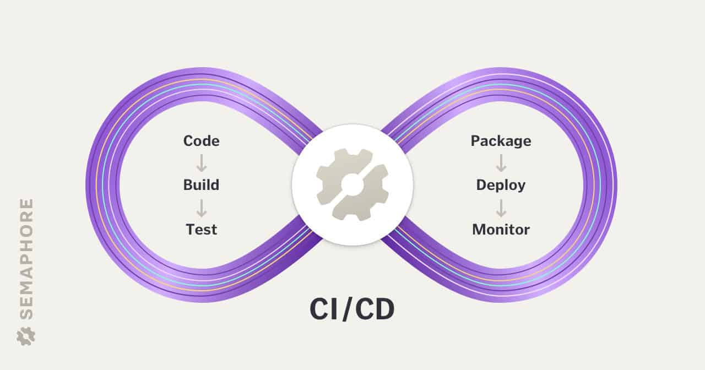
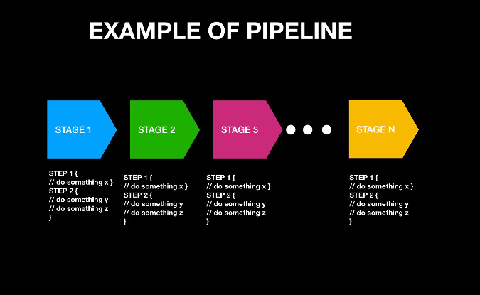

### Concepts of Continuous Integration (CI)

+ CI/CD is a way of developing software in which you’re able to release updates at any time in a sustainable way. When changing code is routine, development cycles are more frequent, meaningful and faster.

+ In Continuous Integration after a code commit, the software is built and tested `immediately`. In a large project with many developers, commits are made many times during a day. With each commit code is built and tested. If the test is passed, build is tested for deployment. If deployment is a success, the code is pushed to production. This commit, build, test, and deploy is a continuous process and hence the name continuous integration/deployment.

    

        
    

+ How `CI works?`
  + Developers write code and commit changes to the `shared repository`
  + After that, the `CI server` monitors the repository and evaluates all the changes
  + CI builds the system and conduct integration and unit tests
  + The server `releases` deployable artifacts
  + The Continous integration server assigns a `build tag` to the version and building code
  + Then the CI server `reports` the team about the successful build. If the `tests fail`, the server alerts about the event to the development team. The team will fix the issues as fast as is possible.

### Introducing to Jenkins

+ Jenkins is an open source Continuous Integration server `(CI server)`

+ Why use Continuous Integration with Jenkins?

    |  Before Jenkins |  After Jenkins |
    |---|---|
    |  Once all Developers had completed their assigned coding tasks, they used to commit their code all `at same time`. Later, Build is tested and deployed. | The code is built and test `as soon as` Developer commits code. Jenkin will build and test code many times during the day  |
    |  Code commit built, and test cycle was very infrequent, and a single build was done after `many days`. | If the build is successful, then Jenkins will deploy the source into the test server and `notifies` the deployment team.  |
    | Since the code was built all at once, some developers would need to wait until other developers finish coding to check their build  | The code is built immediately after any of the Developer commits.  |
    | It is not an easy task to isolate, detect, and fix errors for multiple commits.  | Since the code is built after each commit of a single developer, it's easy to detect `whose code caused the built to fail`  |
    | Code build and test process are entirely manual, so there are a lot of chances for failure.  | Automated build and test process saving timing and reducing defects.  |
    | The code is deployed once all the errors are fixed and tested.  | The code is deployed after every successful build and test.  |

### Job types in Jenkins

+ Freestyle project
+ Pipeline
+ External job

### Freestyle and Pipeline Jenkins Jobs

+ Freestyle projects for simple tasks: This is a general purpose project that is meant to build or run simple jobs like allowing you to specify the version control system from which you need to extract code and build it and call tests if available. This type of projects is meant to orchestrate simple jobs for a project.

+ Pipeline projects for larger projects: This is a new type of Jenkins project that is applicable when you need to setup continuous delivery pipeline or say you want to define the deployment pipeline as code.

+ In the Freestyle job everything is executed in `the agent`, but for the Scripted Pipeline Job, the pipeline code is translated in the master to atomic commands that are sent to the agents.

### Jenkins pipeline

> A pipeline is a sequence of events or jobs that can be executed.

+ Stage: A block that contains a series of steps. A stage block can be named anything; it is used to visualize the pipeline process.
+ Step: A task that says what to do. Steps are defined inside a stage block.

    

        
    

+ `Elements` of a CI/CD pipeline
  + Source stage: In most cases a pipeline run is triggered by a source code repository.
  + Build stage
  + Test stage
  + Deploy stage

+ What makes a good pipeline?
  + Speed
  + Reliability: A reliable pipeline always `produces the same output for a given input`, and with no oscillations in runtime. Intermittent failures cause intense frustration among developers.

### A few concepts around Maven

+ Maven is a powerful `build tool` for Java software projects.

+ Build Tool: automates everything related to building the software project. `Building a software project` typically includes one or more of these activities:
  + Generating `source code` (if auto-generated code is used in the project).
  + Generating documentation from the source code.
  + `Compiling` source code.
  + `Packaging` compiled code into JAR files or ZIP files.
  + `Installing` the packaged code on a server, in a `repository` or `somewhere else.`

+ Maven is centered around the concept of `POM files (Project Object Model)`. A POM file is an XML representation of project resources like source code, test code, dependencies (external JARs used) etc. The POM contains references to all of these resources. The POM file should be located in the root directory of the project it belongs to.

+ Maven has three types of repository:
  + Local repository
  + Central repository
  + Remote repository

### References

+ [Guru99 - What is Jenkins?](https://www.guru99.com/jenkin-continuous-integration.html)
+ [Semaphoreci - CI/CD Pipeline: A Gentle Introduction](https://semaphoreci.com/blog/cicd-pipeline)
+ [Opensource.com - Building CI/CD pipelines with Jenkins](https://opensource.com/article/19/9/intro-building-cicd-pipelines-jenkins)
+ [CloudBees.com - Main differences between Freestyle - Scripted Pipeline Job - Declarative Pipeline Job](https://support.cloudbees.com/hc/en-us/articles/115003908372-Main-differences-between-Freestyle-Scripted-Pipeline-Job-Declarative-Pipeline-Job)